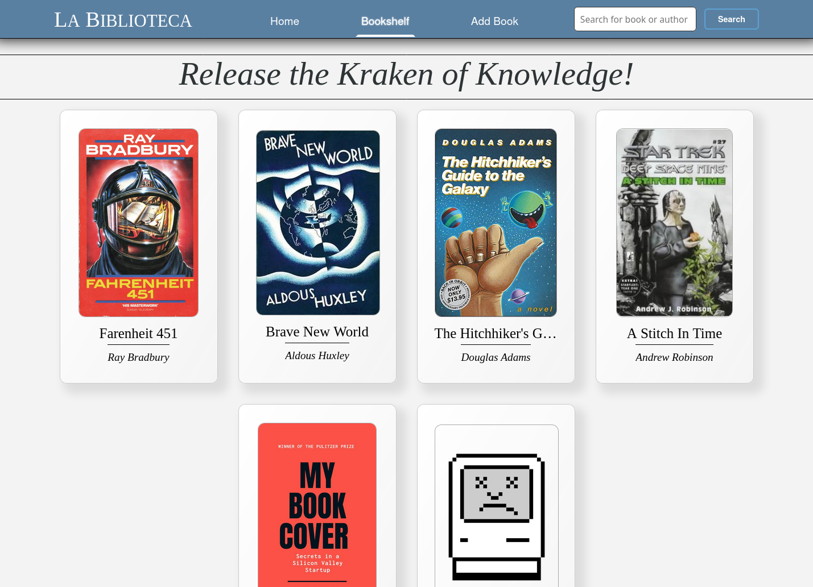

# La Biblioteca

**_See it live at [https://biblioteca-pf7p.onrender.com/](https://biblioteca-pf7p.onrender.com/)_**

A feature complete CRUD app written from scratch using React, SASS, Express, Sequelize, and MySQL. Originally written for a class assignment, it is here for posterity and for potential employers.

## Known Issues

The free-tier API server spins down on inactivity. It can take over 30s to boot up on first load. 

## Running the code

You can start the local dev server by cloning the repo and running:

    cd server
    npm install
    npm run start:dev

(obviously you'll need NPM. v16+ appear to work)

## About the code

The project was written in stages, first with `json-server` to simulate a backend, then with Express calling a cloud-based MySQL server. However, my license to access the MySQL instance expired when I finished the class, and I do not want to deal with the headache of self-hosting a MySQL instance nor paying for one, so I am using json-server again as a replacement. The original Sequelize code and MySQL config is left in place (but either commented or no longer imported) for inspection.

[my-json-server.typicode.com](https://my-json-server.typicode.com) provides a read-only json-server instance (but simulates a read-write), which I'm using to minimize necessary work. The Express backend and React frontend are on Render free tier servers. Once upon a time I wanted to self-host this as a learning excercise, which I'm sure I could do without too much headache using Caddy and my remaining free Oracle Cloud credits, but it's not worth it. The Express app is now mostly vestigial, it's just proxying requests to json-server, but it's proof I can write some Node code :smile:

The database does not persist changes, though write calls will report as successful. Running locally will persist changes to the db.json on your filesystem
